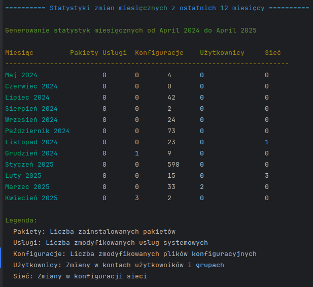
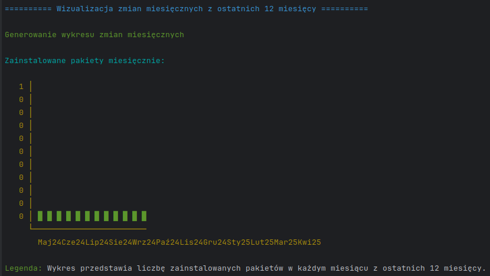
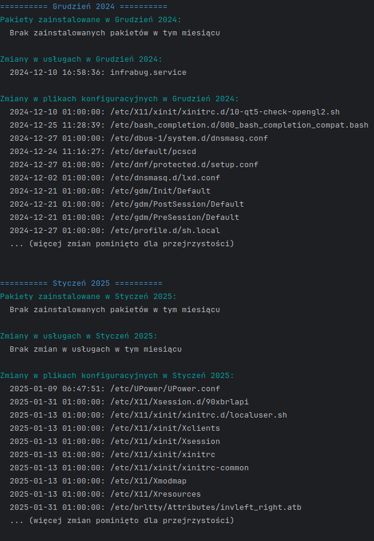

# Hello System Scanner - Kompletna dokumentacja


**Wersja: 1.2.0**

---

## Spis treści

1. [Wprowadzenie](#wprowadzenie)
2. [Instalacja](#instalacja)
3. [Architektura projektu](#architektura-projektu)
4. [Sposób użycia](#sposób-użycia)
   - [Opcje wiersza poleceń](#opcje-wiersza-poleceń)
   - [Przykłady użycia](#przykłady-użycia)
5. [Funkcje szczegółowe](#funkcje-szczegółowe)
   - [Informacje o systemie](#informacje-o-systemie)
   - [Zarządzanie pakietami](#zarządzanie-pakietami)
   - [Usługi i procesy](#usługi-i-procesy)
   - [Analiza sieci](#analiza-sieci)
   - [Śledzenie zmian w systemie](#śledzenie-zmian-w-systemie)
   - [Raporty miesięczne](#raporty-miesięczne)
6. [Wyniki i wizualizacje](#wyniki-i-wizualizacje)
7. [Rozwijanie projektu](#rozwijanie-projektu)
8. [Rozwiązywanie problemów](#rozwiązywanie-problemów)
9. [Często zadawane pytania (FAQ)](#często-zadawane-pytania-faq)
10. [Porównanie wersji](#porównanie-wersji)
11. [Licencja i prawa autorskie](#licencja-i-prawa-autorskie)
12. [Kontakt i wsparcie](#kontakt-i-wsparcie)

---

## Wprowadzenie

**Hello System Scanner** to zaawansowane narzędzie diagnostyczne dla systemów Linux, zaprojektowane przez zespół DevOpsTerminal. Skrypt umożliwia administratorom systemów oraz specjalistom DevOps kompleksową analizę i monitorowanie zmian w systemie Linux.

### Główne możliwości

- Identyfikacja zainstalowanego oprogramowania i usług
- Wykrywanie otwartych portów i usług nasłuchujących
- Analiza konfiguracji sieci
- Śledzenie zmian w systemie od określonej daty
- Generowanie raportów miesięcznych z wizualizacjami
- Monitorowanie zmian w plikach konfiguracyjnych
- Analiza zmian dotyczących użytkowników i uprawnień

### Wspierane dystrybucje

Hello System Scanner jest kompatybilny z większością popularnych dystrybucji Linux, w tym:
- Ubuntu/Debian
- Fedora/RHEL/CentOS
- Arch Linux
- openSUSE
- oraz inne dystrybucje oparte na tych systemach

Skrypt automatycznie wykrywa menedżer pakietów i dostosowuje swoje działanie do konkretnej dystrybucji.

---

### Metody instalacji


#### Wymagania
- `curl`
- `bash`
- `sha256sum`


#### Bezpieczna instalacja z weryfikacją sumy kontrolnej

##### Bezpośrednie pobranie i wykonanie z repozytorium github
```bash 
wget -O install.sh https://raw.githubusercontent.com/DevOpsTerminal/hello/main/install.sh && bash install.sh
```

##### Bezpośrednie pobranie z domeny DevOps Terminal
```bash
curl -sSL https://raw.githubusercontent.com/DevOpsTerminal/hello/main/install.sh | bash
```

##### Ręczne pobieranie i weryfikacja

```bash
# Pobierz skrypt
wget https://raw.githubusercontent.com/DevOpsTerminal/hello/main/hello.sh

# Pobierz sumę kontrolną
wget https://raw.githubusercontent.com/DevOpsTerminal/hello/main/checksums.sha256

# Zweryfikuj sumę kontrolną
sha256sum -c checksums.sha256
```

#### Bezpośrednie pobranie i uruchomienie

```bash
# Za pomocą curl
curl -sSL https://raw.githubusercontent.com/DevOpsTerminal/hello/main/hello.sh -o hello.sh

# Za pomocą wget
wget https://raw.githubusercontent.com/DevOpsTerminal/hello/main/hello.sh

# Nadaj uprawnienia wykonania
chmod +x hello.sh

# Uruchom skrypt
./hello.sh
```


## Support

- Upewnij się, że posiadasz wymagane narzędzia (`curl`, `bash`, `sha256sum`)
- Sprawdź połączenie internetowe
- Zweryfikuj sumę kontrolną przed uruchomieniem skryptu

- **Suma kontrolna**: Każde pobranie jest weryfikowane za pomocą SHA256
- **Źródła**: Oficjalne repozytorium GitHub i domena DevOps Terminal
- **Uprawnienia**: Możliwość uruchomienia bez uprawnień roota

## Wsparcie

W razie problemów skontaktuj się z administratorem lub otwórz zgłoszenie w repozytorium GitHub.


#### Instalacja dla użytkowników bez uprawnień roota

Skrypt może być uruchomiony bez uprawnień administratora, jednak pewne funkcje będą ograniczone:

```bash
./hello.sh
```

Po uruchomieniu pojawi się ostrzeżenie:
```
Uwaga: Skrypt nie jest uruchomiony jako root. Niektóre informacje mogą być niedostępne.
```

---

## Architektura projektu

Hello System Scanner został zaprojektowany z myślą o modułowości i łatwości rozszerzania. Struktura projektu wygląda następująco:

```
hello/
├── src/
│   ├── functions/        # Katalog zawierający pliki z poszczególnymi funkcjami
│   │   ├── command_exists.sh
│   │   ├── date_timestamp.sh
│   │   ├── detect_distro.sh
│   │   └── ... (pozostałe funkcje)
│   ├── main/             # Katalog z głównymi plikami programu
│       ├── colors.sh     # Konfiguracja kolorów
│       ├── defaults.sh   # Domyślne wartości zmiennych
│       └── main.sh       # Główna funkcja programu
├── hello.sh              # Finalny skrypt (wygenerowany)
├── create_structure.sh   # Skrypt tworzący strukturę folderów
└── merge_files.sh        # Skrypt łączący pliki w jeden skrypt wykonawczy
```

### Opis głównych komponentów

#### Katalog `src/functions/`

Zawiera zestaw wyspecjalizowanych funkcji, każda w oddzielnym pliku:

1. `print_header.sh` - funkcja wyświetlająca nagłówki
2. `command_exists.sh` - sprawdzanie dostępności polecenia
3. `date_timestamp.sh` - funkcje obsługi dat i czasów
4. `detect_distro.sh` - wykrywanie dystrybucji Linux
5. `get_system_info.sh` - pobieranie informacji o systemie
6. `get_installed_packages.sh` - pobieranie listy zainstalowanych pakietów
7. `get_running_services.sh` - pobieranie listy uruchomionych usług
8. `check_open_ports.sh` - sprawdzanie otwartych portów
9. `check_startup_programs.sh` - sprawdzanie programów startowych
10. `check_config_changes.sh` - sprawdzanie zmian w plikach konfiguracyjnych
11. `find_recent_packages.sh` - znajdowanie ostatnio zainstalowanych pakietów
12. `check_repositories.sh` - sprawdzanie repozytoriów
13. `track_user_changes.sh` - śledzenie zmian w użytkownikach i grupach
14. `track_binary_changes.sh` - śledzenie zmian w plikach binarnych
15. `track_scheduled_tasks.sh` - śledzenie zmian w zadaniach cron
16. `check_network_changes.sh` - sprawdzanie zmian w konfiguracji sieci
17. `check_system_timestamps.sh` - sprawdzanie czasów modyfikacji plików systemowych
18. `visualize_monthly_changes.sh` - wizualizacja zmian miesięcznych
19. `generate_monthly_stats.sh` - generowanie statystyk miesięcznych
20. `generate_monthly_reports.sh` - generowanie raportów miesięcznych
21. `save_results.sh` - zapisywanie wyników do pliku
22. `set_tracking_date.sh` - ustawianie daty śledzenia zmian

#### Katalog `src/main/`

Zawiera pliki konfiguracyjne i główne funkcje programu:

1. `colors.sh` - definicje kolorów dla interfejsu użytkownika
2. `defaults.sh` - domyślne wartości zmiennych
3. `main.sh` - główna funkcja programu z logiką wykonania

#### Pliki główne

1. `hello.sh` - finalny skrypt wygenerowany przez proces scalania
2. `create_structure.sh` - skrypt tworzący strukturę katalogów projektu
3. `merge_files.sh` - skrypt łączący wszystkie moduły w jeden wykonywalny skrypt

### Proces generowania skryptu

Finalna wersja `hello.sh` jest generowana przez uruchomienie skryptu `merge_files.sh`, który łączy wszystkie funkcje i moduły w jeden plik wykonawczy. Ten proces umożliwia modułową pracę nad projektem, zachowując wygodę dystrybucji jako pojedynczego pliku.

---

## Sposób użycia

Hello System Scanner może być używany w dwóch głównych trybach:
1. **Tryb parametrów wiersza poleceń** - szybkie uruchamianie konkretnych funkcji
2. **Tryb interaktywny** - menu z wyborem opcji dla łatwiejszego przeglądania

### Opcje wiersza poleceń

```bash
./hello.sh [OPCJE]
```

#### Podstawowe opcje

| Opcja | Pełna nazwa | Opis |
|-------|-------------|------|
| `-h` | `--help` | Wyświetla pomoc i listę dostępnych opcji |
| | `--version` | Wyświetla informacje o wersji programu |
| | `--all` | Uruchamia wszystkie dostępne funkcje analizy |
| | `--save-all` | Zapisuje wyniki do pliku |

#### Informacje o systemie

| Opcja | Opis |
|-------|------|
| `--system-info` | Podstawowe informacje o systemie operacyjnym |
| `--packages` | Lista zainstalowanych pakietów |
| `--services` | Lista uruchomionych usług systemowych |
| `--ports` | Lista otwartych portów i nasłuchujących usług |
| `--startup` | Programy uruchamiane przy starcie systemu |
| `--recent-packages` | Ostatnio zainstalowane pakiety |
| `--repositories` | Skonfigurowane repozytoria pakietów |

#### Śledzenie zmian

| Opcja | Opis |
|-------|------|
| `--track-changes=DATA` | Ustaw datę śledzenia zmian (np. "7 days ago", "2023-01-15") |
| `--config-changes` | Zmiany w plikach konfiguracyjnych |
| `--user-changes` | Zmiany w użytkownikach i grupach |
| `--binary-changes` | Zmiany w plikach binarnych i skryptach |
| `--scheduled-tasks` | Zmiany w zaplanowanych zadaniach (cron) |
| `--network-changes` | Zmiany w konfiguracji sieci |
| `--system-timestamps` | Zmiany w kluczowych plikach systemowych |

#### Raporty miesięczne

| Opcja | Opis |
|-------|------|
| `--monthly-report` | Generuje szczegółowy raport miesięczny |
| `--monthly-stats` | Generuje statystyki miesięczne |
| `--monthly-visualize` | Generuje wizualizację miesięcznych zmian |

### Przykłady użycia

#### Podstawowe analizy systemu

```bash
# Wyświetlenie wszystkich informacji o systemie
sudo ./hello.sh --all

# Sprawdzenie podstawowych informacji o systemie
sudo ./hello.sh --system-info

# Sprawdzenie zainstalowanych pakietów
sudo ./hello.sh --packages

# Sprawdzenie otwartych portów
sudo ./hello.sh --ports
```

#### Śledzenie zmian w systemie

```bash
# Sprawdzenie zmian od ostatniego tygodnia
sudo ./hello.sh --track-changes="1 week ago" --all

# Sprawdzenie zmian w plikach konfiguracyjnych od konkretnej daty
sudo ./hello.sh --track-changes="2023-05-15" --config-changes

# Sprawdzenie zmian w użytkownikach i grupach od miesiąca
sudo ./hello.sh --track-changes="1 month ago" --user-changes
```

#### Raporty i statystyki miesięczne

```bash
# Generowanie pełnego raportu miesięcznego
sudo ./hello.sh --monthly-report

# Generowanie statystyk z ostatnich 12 miesięcy
sudo ./hello.sh --monthly-stats

# Wizualizacja zmian w pakietach
sudo ./hello.sh --monthly-visualize
```

#### Łączenie wielu opcji

```bash
# Sprawdzenie zmian w systemie i usługach oraz wygenerowanie raportu
sudo ./hello.sh --track-changes="2 weeks ago" --services --config-changes --save-all

# Kompleksowa analiza bezpieczeństwa
sudo ./hello.sh --ports --user-changes --binary-changes --system-timestamps
```

---

## Funkcje szczegółowe

### Informacje o systemie

Funkcja `--system-info` zbiera i wyświetla szczegółowe informacje o systemie operacyjnym:

- Nazwa i wersja dystrybucji
- Wersja jądra (kernel)
- Architektura systemu
- Szacowana data instalacji systemu
- Podstawowe informacje o sprzęcie (jeśli dostępne)

Przykładowe użycie:
```bash
sudo ./hello.sh --system-info
```

### Zarządzanie pakietami

Hello System Scanner oferuje szereg narzędzi do analizy pakietów:

#### Lista zainstalowanych pakietów (`--packages`)

Wyświetla pełną listę zainstalowanych pakietów, automatycznie wykrywając system zarządzania pakietami:
- dpkg/apt dla Debian/Ubuntu
- rpm/dnf/yum dla Fedora/RHEL/CentOS
- pacman dla Arch Linux

#### Ostatnio zainstalowane pakiety (`--recent-packages`)

Pokazuje listę ostatnio zainstalowanych pakietów wraz z datami instalacji.

#### Repozytoria pakietów (`--repositories`)

Wyświetla skonfigurowane repozytoria pakietów:
- Repozytoria APT dla Debian/Ubuntu
- Repozytoria YUM/DNF dla Fedora/RHEL/CentOS
- Repozytoria Pacman dla Arch Linux

### Usługi i procesy

#### Uruchomione usługi (`--services`)

Analizuje i wyświetla uruchomione usługi systemowe:
- Usługi systemd
- Usługi init.d
- Aktywne stany usług

#### Programy startowe (`--startup`)

Wyświetla programy i usługi uruchamiane przy starcie systemu:
- Usługi systemowe włączone przy starcie
- Programy startowe XDG
- Zawartość rc.local

### Analiza sieci

#### Otwarte porty (`--ports`)

Skanuje i wyświetla informacje o otwartych portach i usługach nasłuchujących:
- Numer portu i protokół (TCP/UDP)
- Proces nasłuchujący (jeśli identyfikowalny)
- Interfejs sieciowy

```bash
sudo ./hello.sh --ports
```

#### Konfiguracja sieci (`--network-changes`)

Analizuje pliki konfiguracyjne sieci:
- Konfiguracja interfejsów
- Ustawienia DNS
- Konfiguracja routingu

### Śledzenie zmian w systemie

Hello System Scanner umożliwia śledzenie zmian w systemie od określonej daty:

```bash
sudo ./hello.sh --track-changes="2023-06-01"
```

Obsługiwane formaty dat:
- YYYY-MM-DD (np. "2023-06-01")
- Relative dates (np. "7 days ago", "1 month ago")
- Określenia: "yesterday", "last week", "last month"

#### Zmiany w plikach konfiguracyjnych (`--config-changes`)

Śledzi zmiany w katalogu `/etc` i innych lokalizacjach konfiguracyjnych.

#### Zmiany dotyczące użytkowników (`--user-changes`)

Monitoruje zmiany w kontach użytkowników i grupach:
- Modyfikacje plików /etc/passwd, /etc/shadow, /etc/group
- Logi dotyczące dodawania/usuwania/modyfikacji użytkowników

#### Zmiany w plikach binarnych (`--binary-changes`)

Śledzi zmiany w plikach wykonywalnych i skryptach systemowych.

#### Zmiany w zadaniach cron (`--scheduled-tasks`)

Monitoruje zmiany w zaplanowanych zadaniach:
- Zadania cron
- Timery systemd

#### Zmiany w kluczowych plikach systemowych (`--system-timestamps`)

Sprawdza czasy modyfikacji ważnych plików systemowych:
- Pliki konfiguracyjne boot
- Konfiguracja sieciowa
- Konfiguracja bezpieczeństwa
- Moduły jądra

### Raporty miesięczne

Hello System Scanner oferuje zaawansowane narzędzia do analizy trendów w systemie:

#### Szczegółowy raport miesięczny (`--monthly-report`)

Generuje pełny raport zmian dla każdego miesiąca z ostatnich 12 miesięcy:
- Zainstalowane pakiety w poszczególnych miesiącach
- Zmiany w usługach
- Zmiany w plikach konfiguracyjnych

```bash
sudo ./hello.sh --monthly-report
```

#### Statystyki miesięczne (`--monthly-stats`)

Generuje tabelę statystyk dla każdego miesiąca:
- Liczba zainstalowanych pakietów
- Liczba zmodyfikowanych usług
- Liczba zmian w plikach konfiguracyjnych
- Zmiany w użytkownikach
- Zmiany w konfiguracji sieci

```bash
sudo ./hello.sh --monthly-stats
```

#### Wizualizacja zmian miesięcznych (`--monthly-visualize`)

Tworzy graficzną reprezentację zmian w systemie:
- Wykres słupkowy zainstalowanych pakietów
- Prezentacja trendów w czasie

```bash
sudo ./hello.sh --monthly-visualize
```

---

## Wyniki i wizualizacje

Hello System Scanner generuje różnorodne wyniki w formie tekstu i wizualizacji.

### Wykresy miesięcznych zmian

```
Zainstalowane pakiety miesięcznie:

   50 │ █                                     
   45 │ █                                     
   40 │ █                                     
   35 │ █                █                    
   30 │ █     █          █                    
   25 │ █     █          █ █                  
   20 │ █     █     █    █ █                  
   15 │ █ █   █     █    █ █                  
   10 │ █ █   █ █   █    █ █ █                
    5 │ █ █ █ █ █ █ █    █ █ █ █ █            
     └────────────────────────────────────
       Sty Feb Mar Kwi Maj Cze Lip Sie Wrz Paź Lis Gru
```

### Tabele statystyk miesięcznych

```
Miesiąc         Pakiety Usługi Konfiguracje Użytkownicy Sieć
----------------------------------------------------------------------
Styczeń 2023    45      12     87           2           4
Luty 2023       12      3      24           0           1
Marzec 2023     28      5      32           1           2
```

### Zapisywanie wyników do pliku

Wszystkie wyniki mogą być zapisane do pliku za pomocą opcji `--save-all`:

```bash
sudo ./hello.sh --monthly-stats --save-all
```

Skrypt generuje plik raportu z nazwą zawierającą datę i czas, np. `system_software_20230710_152233.txt`.


## Examples

### 16) Raport zmian miesięcznych (ostatnie 12 miesięcy)



### 17) Statystyki miesięczne (ostatnie 12 miesięcy)




### 18) Wizualizacja zmian miesięcznych




---

## Rozwijanie projektu

Hello System Scanner jest projektem modułowym, co ułatwia rozszerzanie jego funkcjonalności.

### Tworzenie nowych funkcji

1. Utwórz nowy plik funkcji w katalogu `src/functions/`:
   ```bash
   touch src/functions/my_new_function.sh
   ```

2. Zaimplementuj funkcję w pliku:
   ```bash
   #!/bin/bash
   
   # Opis nowej funkcji
   my_new_function() {
       print_header "Nagłówek mojej nowej funkcji"
       
       # Implementacja funkcji
       echo "Przykładowy wynik"
   }
   ```

3. Uruchom skrypt łączący, aby wygenerować zaktualizowany plik hello.sh:
   ```bash
   ./scripts/merge.sh
   ```

### Modyfikacja istniejących funkcji

1. Zlokalizuj plik funkcji w katalogu `src/functions/`
2. Wprowadź zmiany
3. Uruchom skrypt łączący, aby wygenerować zaktualizowany skrypt

### Zgłaszanie problemów i propozycji

Zachęcamy do zgłaszania problemów i propozycji ulepszeń poprzez system GitHub Issues:
[github.com/DevOpsTerminal/hello/issues](https://github.com/DevOpsTerminal/hello/issues)

### Tworzenie pull requestów

1. Utwórz fork repozytorium
2. Utwórz swoją gałąź funkcji (`git checkout -b feature/AmazingFeature`)
3. Zatwierdź swoje zmiany (`git commit -m 'Add some AmazingFeature'`)
4. Wypchnij do gałęzi (`git push origin feature/AmazingFeature`)
5. Otwórz Pull Request

---

## Rozwiązywanie problemów

### Typowe problemy i rozwiązania

#### Problem: Brak uprawnień dostępu

**Komunikat:**
```
Uwaga: Skrypt nie jest uruchomiony jako root. Niektóre informacje mogą być niedostępne.
```

**Rozwiązanie:**
Uruchom skrypt z uprawnieniami administratora:
```bash
sudo ./hello.sh
```

#### Problem: Brak znalezionego menedżera pakietów

**Komunikat:**
```
Nie znaleziono znanego menedżera pakietów
```

**Rozwiązanie:**
- Sprawdź, czy system używa nietypowego menedżera pakietów
- Upewnij się, że podstawowe narzędzia są zainstalowane
- Skontaktuj się ze wsparciem technicznym dla niestandardowych dystrybucji

#### Problem: Nieprawidłowy format daty przy śledzeniu zmian

**Komunikat:**
```
Nieprawidłowy format daty: [wprowadzona_data]
```

**Rozwiązanie:**
Użyj jednego z obsługiwanych formatów daty:
```bash
sudo ./hello.sh --track-changes="2023-06-01"
sudo ./hello.sh --track-changes="7 days ago"
sudo ./hello.sh --track-changes="last month"
```

#### Problem: Brak dostępu do logów systemowych

**Komunikat:**
```
Brak dostępnych logów dla tego miesiąca
```

**Rozwiązanie:**
- Upewnij się, że logijesz się jako root
- Sprawdź, czy logi systemowe są dostępne w standardowej lokalizacji
- W niektórych systemach logi mogą być rotowane lub przechowywane w niestandardowych lokalizacjach

### Diagnostyka zaawansowana

Aby dokładniej przeanalizować problem:

1. Sprawdź wersję bash:
   ```bash
   bash --version
   ```

2. Upewnij się, że wszystkie wymagane narzędzia są dostępne:
   ```bash
   which find grep awk sed stat date
   ```

3. Sprawdź uprawnienia do kluczowych katalogów:
   ```bash
   ls -la /var/log/
   ls -la /etc/
   ```

### Zgłaszanie błędów

Jeśli napotkasz problem, który nie jest opisany w tej dokumentacji:

1. Zbierz informacje diagnostyczne:
   - Wersja skryptu (`./hello.sh --version`)
   - Dystrybucja Linux i wersja
   - Dokładny komunikat błędu
   - Kroki, aby odtworzyć problem

2. Utwórz zgłoszenie problemu na GitHub:
   [github.com/DevOpsTerminal/hello/issues](https://github.com/DevOpsTerminal/hello/issues)

---

## Często zadawane pytania (FAQ)

### Ogólne

#### Czy skrypt jest bezpieczny do użycia na systemach produkcyjnych?

Tak, skrypt działa wyłącznie w trybie odczytu i nie wprowadza żadnych zmian w systemie. Jest to bezpieczne narzędzie diagnostyczne.

#### Czy Hello System Scanner działa na wszystkich dystrybucjach Linux?

Skrypt został zaprojektowany do pracy z większością popularnych dystrybucji. Może wymagać dostosowania dla niszowych lub wysoce zmodyfikowanych systemów.

#### Czy mogę używać Hello System Scanner bez uprawnień roota?

Tak, jednak niektóre funkcje będą ograniczone. Bez uprawnień roota, skrypt nie będzie mógł dostępować do niektórych plików systemowych i logów.

### Funkcjonalność

#### Jak dużo przestrzeni dyskowej zajmuje skrypt?

Sam skrypt jest bardzo lekki (zwykle poniżej 500KB). Generowane raporty również są niewielkie, zazwyczaj poniżej 1MB, chyba że system ma ekstremalnie dużo zainstalowanych pakietów.

#### Czy skrypt działa na serwerach bez środowiska graficznego?

Tak, skrypt jest zaprojektowany do pracy w środowisku tekstowym i nie wymaga środowiska graficznego.

#### Czy mogę uruchomić skrypt z harmonogramu (cron)?

Tak, skrypt może być uruchamiany z crona, na przykład do regularnego generowania raportów:

```bash
# Przykład uruchomienia cotygodniowego raportu
0 0 * * 0 /path/to/hello.sh --monthly-stats --save-all
```

### Dane i prywatność

#### Czy skrypt wysyła jakiekolwiek dane do zewnętrznych serwerów?

Nie, Hello System Scanner działa całkowicie lokalnie i nie wysyła żadnych danych na zewnątrz systemu.

#### Czy wykrywa dane osobowe lub wrażliwe?

Skrypt skupia się na analizie plików systemowych i konfiguracyjnych, nie analizuje danych użytkownika ani zawartości plików osobistych.

---

## Porównanie wersji

| Funkcja | Community (Free) | Professional | Enterprise |
|---------|-----------------|--------------|------------|
| Podstawowa analiza systemu | ✅ | ✅ | ✅ |
| Analiza pakietów i usług | ✅ | ✅ | ✅ |
| Śledzenie zmian w systemie | ✅ | ✅ | ✅ |
| Raporty miesięczne | ✅ | ✅ | ✅ |
| Rozszerzone wizualizacje | ❌ | ✅ | ✅ |
| Wykrywanie anomalii | ❌ | ✅ | ✅ |
| Eksport do CSV/JSON | ❌ | ✅ | ✅ |
| Raportowanie PDF/HTML | ❌ | ❌ | ✅ |
| Integracja z systemami monitoringu | ❌ | ❌ | ✅ |
| Powiadomienia o zmianach | ❌ | ❌ | ✅ |
| Wsparcie priorytetowe | ❌ | ❌ | ✅ |
| Dedykowane konsultacje | ❌ | ❌ | ✅ |
| **Cena** | Darmowa | $10 (jednorazowo) | Kontakt |

### Opcje aktualizacji do wersji Pro

Aby zakupić wersję Professional, odwiedź stronę:
[devopsterminal.com/buy](https://devopsterminal.com/buy)

### Zapytanie o wersję Enterprise

Dla rozwiązań skalowalnych dla dużych organizacji, skontaktuj się z nami:
[devopsterminal.com/enterprise](https://devopsterminal.com/enterprise)


## Licencja i prawa autorskie

Hello System Scanner jest objęty licencją Apache2. Pełny tekst licencji jest dostępny w pliku [LICENSE](https://github.com/DevOpsTerminal/hello/blob/main/LICENSE).


## Kontakt i wsparcie

### Pomoc techniczna

W przypadku pytań lub problemów technicznych, oferujemy następujące opcje pomocy:

- **Dokumentacja online**: [docs.devopsterminal.com](https://docs.devopsterminal.com)
- **GitHub Issues**: [github.